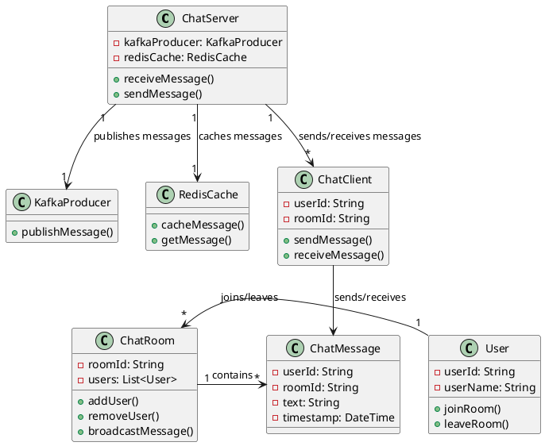
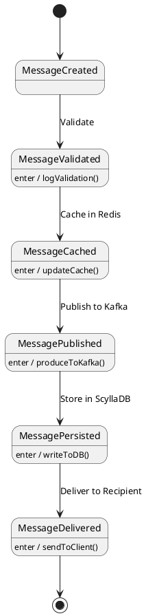
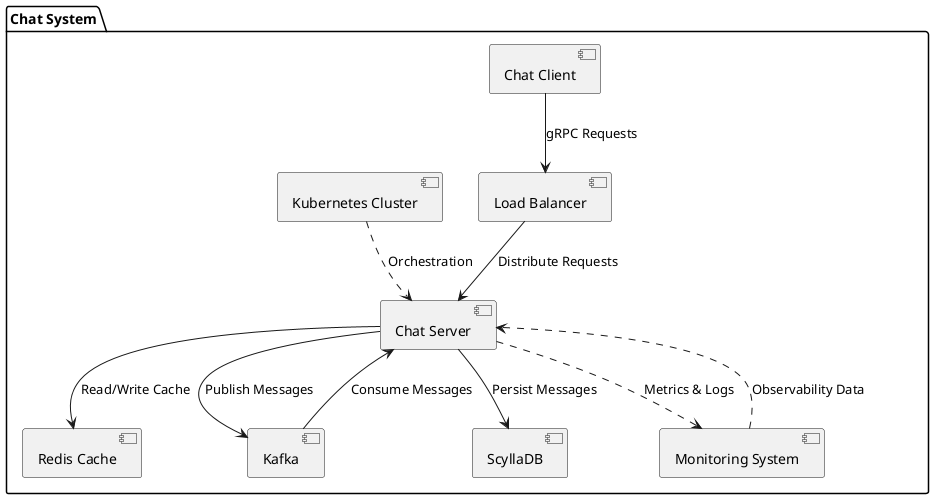
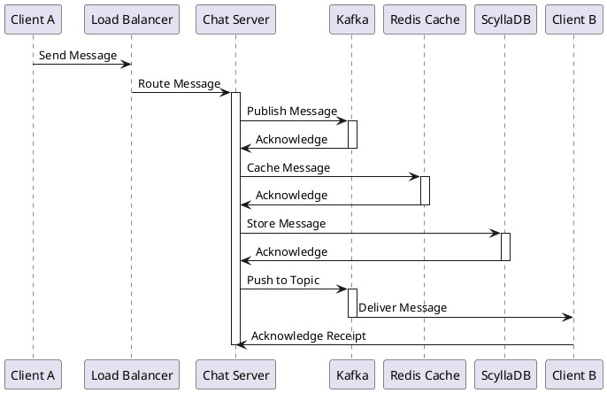

# go-grpc-chat-server
Chat system for vinemesh

## Diagrams

### Class Diagrams

```plantuml
@startuml

class ChatServer {
  - kafkaProducer: KafkaProducer
  - redisCache: RedisCache
  + receiveMessage()
  + sendMessage()
}

class KafkaProducer {
  + publishMessage()
}

class RedisCache {
  + cacheMessage()
  + getMessage()
}

class ChatClient {
  - userId: String
  - roomId: String
  + sendMessage()
  + receiveMessage()
}

class ChatMessage {
  - userId: String
  - roomId: String
  - text: String
  - timestamp: DateTime
}

class User {
  - userId: String
  - userName: String
  + joinRoom()
  + leaveRoom()
}

class ChatRoom {
  - roomId: String
  - users: List<User>
  + addUser()
  + removeUser()
  + broadcastMessage()
}

ChatServer "1" --> "*" ChatClient : sends/receives messages
ChatServer "1" --> "1" KafkaProducer : publishes messages
ChatServer "1" --> "1" RedisCache : caches messages

ChatClient -down-> ChatMessage : sends/receives

User "1" -left-> "*" ChatRoom : joins/leaves
ChatRoom "1" -right-> "*" ChatMessage : contains

@enduml
```

### Class Diagram

```plantuml
@startuml

[*] --> MessageCreated
MessageCreated --> MessageValidated : Validate
MessageValidated --> MessageCached : Cache in Redis
MessageCached --> MessagePublished : Publish to Kafka
MessagePublished --> MessagePersisted : Store in ScyllaDB
MessagePersisted --> MessageDelivered : Deliver to Recipient
MessageDelivered --> [*]

MessageValidated : enter / logValidation()
MessageCached : enter / updateCache()
MessagePublished : enter / produceToKafka()
MessagePersisted : enter / writeToDB()
MessageDelivered : enter / sendToClient()

@enduml
```

### Component Diagram

```plantuml
@startuml

package "Chat System" {
    [Chat Client] as Client
    [Chat Server] as Server
    [Kafka] as Kafka
    [Redis Cache] as Redis
    [ScyllaDB] as DB
    [Load Balancer] as LB
    [Monitoring System] as Monitoring
    [Kubernetes Cluster] as K8s
}

Client --> LB : gRPC Requests
LB --> Server : Distribute Requests
Server --> Kafka : Publish Messages
Server --> Redis : Read/Write Cache
Kafka --> Server : Consume Messages
Server --> DB : Persist Messages
Server ..> Monitoring : Metrics & Logs
Monitoring ..> Server : Observability Data
K8s ..> Server : Orchestration

@enduml
```

### Sequence Diagram

```plantuml
@startuml
participant "Client A" as ClientA
participant "Load Balancer" as LB
participant "Chat Server" as Server
participant "Kafka" as Kafka
participant "Redis Cache" as Redis
participant "ScyllaDB" as DB
participant "Client B" as ClientB

ClientA -> LB : Send Message
LB -> Server : Route Message
activate Server
Server -> Kafka : Publish Message
activate Kafka
Kafka -> Server : Acknowledge
deactivate Kafka

Server -> Redis : Cache Message
activate Redis
Redis -> Server : Acknowledge
deactivate Redis

Server -> DB : Store Message
activate DB
DB -> Server : Acknowledge
deactivate DB

Server -> Kafka : Push to Topic
activate Kafka
Kafka -> ClientB : Deliver Message
deactivate Kafka
ClientB -> Server : Acknowledge Receipt
deactivate Server
@enduml
```